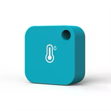
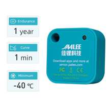
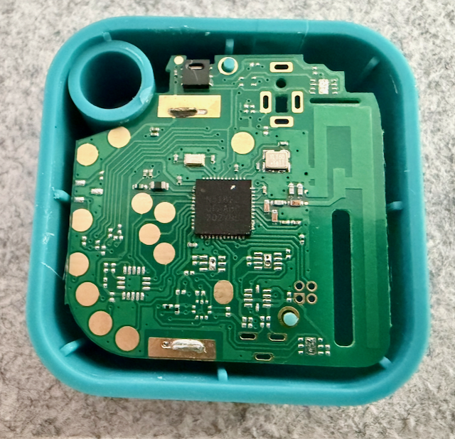
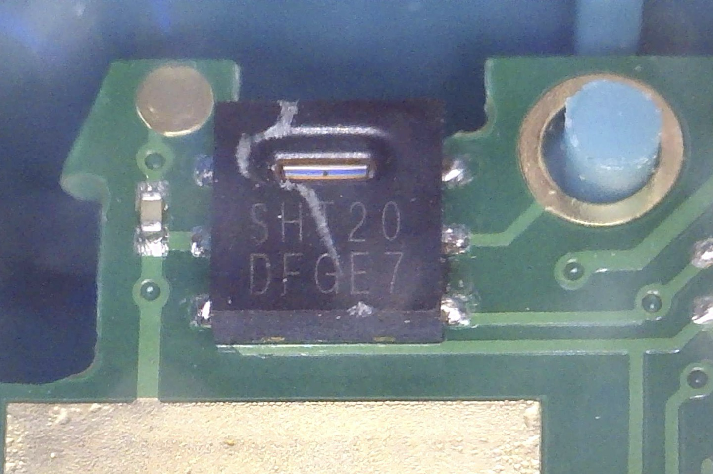

# Jaalee BLE

[![HACS][hacsbadge]][hacs]
[![GitHub Release][releases-shield]][releases]

[![Home Assistant][ha-shield]][ha]
[![Python Version][python-shield]][python]
[![License][license-shield]](LICENSE)

[![Tests][tests-shield]][tests]
[![Code Style: Ruff][ruff-shield]][ruff]
[![GitHub Activity][commits-shield]][commits]

Home Assistant integration for Jaalee Bluetooth Low Energy (BLE) devices.

This integration automatically discovers and monitors Jaalee BLE sensors through passive Bluetooth scanning. It supports temperature, humidity, battery percentage, and Tx Power (dBm) diagnostics. Additional sensor types (CO2, voltage, light, pressure) are prepared for when supported by Jaalee devices. UV is planned for future parser support.

## Supported Devices

### Jaalee JHT Temperature and Humidity Sensor

| Front | Back | Back (SHT20) |
|:-----:|:----:|:------------:|
|  |  |  |

The location of the two holes on the back may help identify the device version.

The JHT sensor broadcasts temperature, humidity, battery level, and Tx Power via iBeacon telemetry with service data UUID `0000f525-0000-1000-8000-00805f9b34fb`.

## How to find your sensor model

| Device (opened) | Sensor |
|:---------------:|:--------------------------:|
|  |  |

Sensor model selection is part of the config flow. Open **Settings** -> **Devices & Services** -> **Jaalee BLE** -> **Configure**, then choose the correct value in **Sensor model**.

## Features

- **Automatic Discovery**: Automatically detects Jaalee BLE devices in range
- **Passive Scanning**: Uses Bluetooth passive scanning mode for efficient battery usage
- **Multiple Sensor Types**:
  - Temperature (°C)
  - Humidity (%)
  - Battery (%)
  - Tx Power (dBm, diagnostic)
- **No YAML Configuration Required**: Devices are discovered through Bluetooth and added with the UI flow

## Requirements

- Home Assistant 2026.3.0 or newer
- Python 3.14 or newer
- Bluetooth adapter (built-in or USB)
- Jaalee BLE device broadcasting iBeacon telemetry

## Installation

### HACS (Recommended)

"Download" and Restart Home Assistant

### Manual Installation

1. Download the latest release from the [releases page][releases]
2. Extract the `custom_components/jaalee` directory to your Home Assistant's `custom_components` directory
3. Restart Home Assistant

## Configuration

1. Go to **Settings** → **Devices & Services**
2. Click **Add Integration**
3. Search for "Jaalee BLE"
4. Select your Jaalee device from the list of discovered devices
5. Click **Submit**

The integration will automatically create sensor entities for:

- Temperature
- Humidity
- Battery
- Tx Power (dBm, diagnostic)

## Development (Devcontainer + Bluetooth)

- Run `scripts/setup` once after cloning. It installs dependencies and links `config/custom_components` to the repository `custom_components` directory.
- Start Home Assistant with `scripts/develop`.
- Optional direct command: `uv run --group dev hass --config config --debug`.
- Run tests with `uv run --group dev pytest`.
- Run type checks with `uv run --group dev mypy custom_components`.
- Run all pre-commit checks with `pre-commit run --all-files`.
- Dependency policy: pin the Home Assistant version we target and rely on its dependency set for transitive packages; avoid manually pinning Home Assistant internals unless there is a documented compatibility break.
- Keep `pycares>=5.0.0,<6` in the dev dependency group; Home Assistant 2026.3.0 requires pycares 5.x.
- On macOS hosts, the VS Code devcontainer cannot map the host Bluetooth adapter for Home Assistant BLE testing.
- On Linux hosts, configure the devcontainer with `--network=host`, `--cap-add=NET_ADMIN`, and `--cap-add=NET_RAW`; these capabilities are required for Home Assistant Bluetooth adapter management and automatic adapter recovery.
- On Linux hosts, mount D-Bus (`/run/dbus`) into the devcontainer if you need full adapter introspection and control.
- On Linux hosts, Bluetooth passthrough may work with host networking/privileged mode and a D-Bus mount.
- If BLE discovery still does not work in-container, run Home Assistant directly on the host or test on a physical Linux machine.

## Troubleshooting

### Device Not Discovered

- Ensure your Jaalee device is powered on and in range
- Check that Bluetooth is enabled in Home Assistant
- Try restarting the Bluetooth adapter

### Sensors Not Updating

- Check the device battery level
- Ensure the device is within Bluetooth range
- Review Home Assistant logs for any error messages

### Bluetooth Recovery Warnings In Development

If you see warnings such as `Operation not permitted` from `bluetooth_auto_recovery.recover`, Home Assistant can usually still scan, but it cannot power-cycle the adapter for recovery.

- In a devcontainer, ensure `--network=host`, `--cap-add=NET_ADMIN`, and `--cap-add=NET_RAW` are active, then rebuild/reopen the container.
- Mount D-Bus (`/run/dbus`) into the container when testing Bluetooth recovery behavior.
- If you run Home Assistant directly on Linux host, run `sudo scripts/enable-bt-caps` once to grant Bluetooth management capabilities to the interpreter used by this project venv.
- To roll back host capability changes, run `sudo scripts/disable-bt-caps`.

If logs mention `passive scanning on Linux requires BlueZ >= 5.56 with --experimental enabled`, verify `bluetoothd` is started with `--experimental`.

- Check current service command: `systemctl show bluetooth -p ExecStart --value`
- If `--experimental` is missing, run `sudo systemctl edit bluetooth` and add:
  - `[Service]`
  - `ExecStart=`
  - `ExecStart=/usr/libexec/bluetooth/bluetoothd --experimental`
- Apply with `sudo systemctl daemon-reload && sudo systemctl restart bluetooth`

## Contributing

Contributions are welcome! Please read [CONTRIBUTING.md](CONTRIBUTING.md) for details on how to contribute to this project.

## License

This project is licensed under the MIT License - see the [LICENSE](LICENSE) file for details.

## Support

- [Report a Bug][issues]
- [Request a Feature][issues]
- [Ask a Question][issues]

---

[releases-shield]: https://img.shields.io/github/release/dan-s-github/ha-jaalee-ble.svg?style=flat&logo=github
[releases]: https://github.com/dan-s-github/ha-jaalee-ble/releases
[commits-shield]: https://img.shields.io/github/commit-activity/y/dan-s-github/ha-jaalee-ble.svg?style=flat&logo=github
[commits]: https://github.com/dan-s-github/ha-jaalee-ble/commits/main
[license-shield]: https://img.shields.io/github/license/dan-s-github/ha-jaalee-ble.svg?style=flat
[python-shield]: https://img.shields.io/badge/python-3.14+-blue.svg?style=flat&logo=python&logoColor=white
[python]: https://www.python.org/
[ha-shield]: https://img.shields.io/badge/Home%20Assistant-2026.3.0+-blue.svg?style=flat&logo=homeassistant&logoColor=white
[ha]: https://www.home-assistant.io/
[tests-shield]: https://img.shields.io/github/actions/workflow/status/dan-s-github/ha-jaalee-ble/ci.yml?branch=main&style=flat&logo=github
[tests]: https://github.com/dan-s-github/ha-jaalee-ble/actions/workflows/ci.yml
[ruff-shield]: https://img.shields.io/badge/code%20style-ruff-000000.svg?style=flat&logo=ruff&logoColor=white
[ruff]: https://github.com/astral-sh/ruff
[hacs]: https://github.com/hacs/integration
[hacsbadge]: https://img.shields.io/badge/HACS-Custom-orange.svg?style=flat&logo=homeassistant&logoColor=white
[issues]: https://github.com/dan-s-github/ha-jaalee-ble/issues
